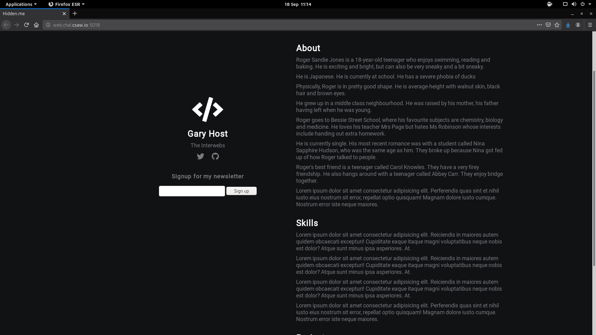
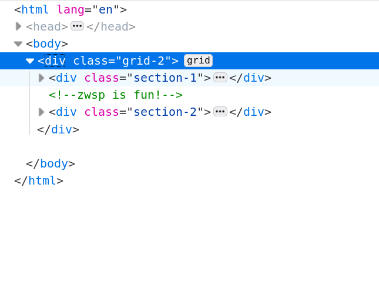
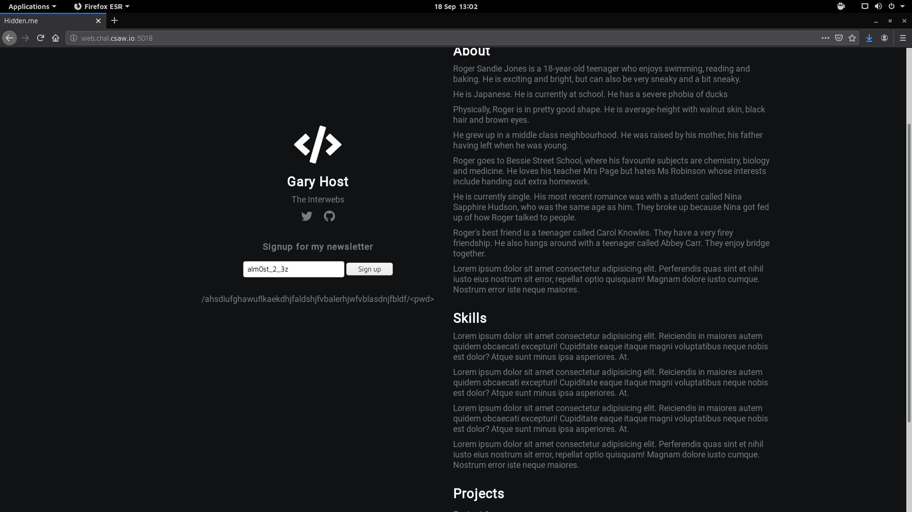
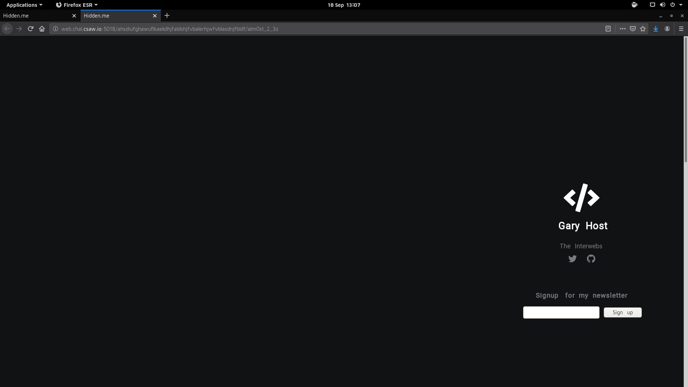
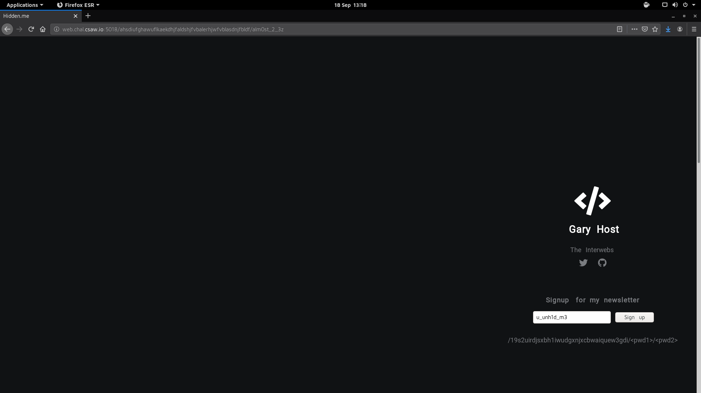
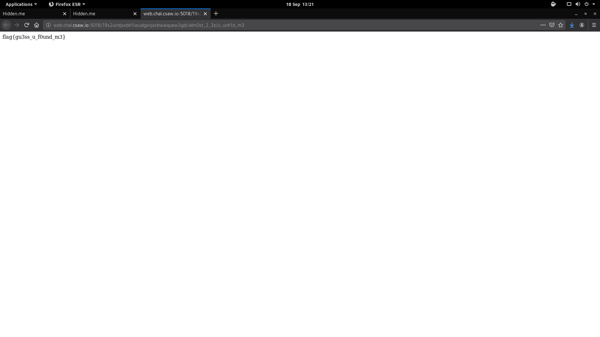

# CSAW CTF Qualification Round 2020

## Widthless

This was a 50 points **web** challenge.

Initially we're given the following message:

> Welcome to web! Let's start off with something kinda funky :) http://web.chal.csaw.io:5018



From the website's name **Hidden.me** and a particular comment in its html source code <!-- zwsp is fun! --> we find that the challenge is about **zero-width-space characters stenography **.



The only obvious place to hide a secret message is in the **hmtl code** of the website. Lets see what we can find with the help of the module **zwsp_steg** (https://pypi.org/project/zwsp-steg-py/):

```python
#!/usr/bin/python3

import zwsp_steg #
import requests

response = requests.get("http://web.chal.csaw.io:5018")
encoded = zwsp_steg.decode(response.text)
print(encoded)
```

We obtain **b'YWxtMHN0XzJfM3o='** which is similar to a **base64** encoded string we just need to format it a little and then decode it:

```python
#!/usr/bin/python3

import zwsp_steg
import requests
import base64

response = requests.get("http://web.chal.csaw.io:5018")
b64_encoded = zwsp_steg.decode(response.text)
formatted_b64 = b64_encoded[2:-1] + "="
decoded = base64.b64decode(formatted_b64.encode('ascii')).decode('ascii')

print(decoded)
```

We obtain **alm0st_2_3z** which is still not the flag. This is where the form in the website is useful. After submitting the string a new message appears:



From what we have, the <pwd> can only be **alm0st_2_3z** so lets try to go to http://web.chal.csaw.io:5018/ahsdiufghawuflkaekdhjfaldshjfvbalerhjwfvblasdnjfbldf/alm0st_2_3z :



Still no flag to be found... let's try again the same approach:

```python
#!/usr/bin/python3

import zwsp_steg
import requests

response = requests.get("http://web.chal.csaw.io:5018/ahsdiufghawuflkaekdhjfaldshjfvbalerhjwfvblasdnjfbldf/alm0st_2_3z")

decoded = zwsp_steg.decode(response.text)
print(decoded)
```

We obtain **755f756e6831645f6d33** so we just need to convert it from **hexadecimal** to **ASCII**:

```python
#!/usr/bin/python3

import zwsp_steg
import requests

response = requests.get("http://web.chal.csaw.io:5018/ahsdiufghawuflkaekdhjfaldshjfvbalerhjwfvblasdnjfbldf/alm0st_2_3z")

hex_str = zwsp_steg.decode(response.text)
decoded = bytearray.fromhex(hex_str).decode()

print(decoded)
```

We obtain **u_unh1d_m3** which is still not the flag. Submitting it again in the form:



**alm0st_2_3z** being the first <pwd>, <pwd2> can only be **u_unh1d_m3**. Going to http://web.chal.csaw.io:5018/19s2uirdjsxbh1iwudgxnjxcbwaiquew3gdi/alm0st_2_3z/u_unh1d_m3 we can finally obtain the flag! :)


